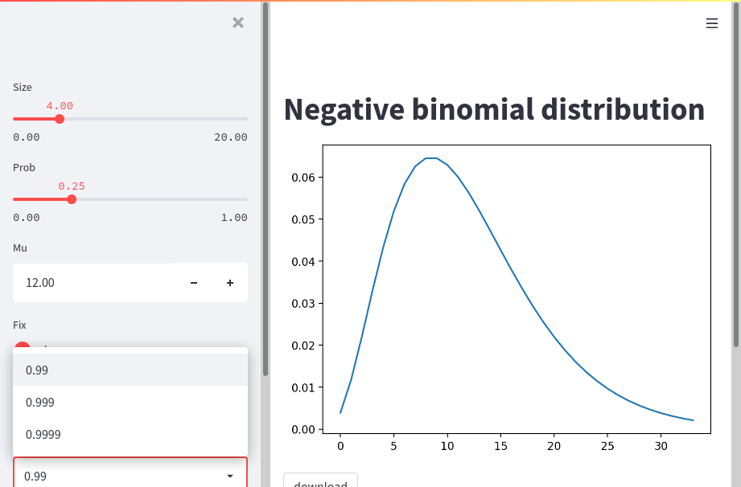

# nbinomPlotPy

The goal of nbinomPlotPy is to show an example of how to build, test, and deploy a Streamlit app.

[](https://github.com/zettsu-t/nbinomPlotPy/actions)



## Build and install

``` bash
python setup.py bdist_wheel
python -m pip install dist/nb_plot_streamlit-0.0.1-cp39-cp39-linux_x86_64.whl
```

or in debugging

``` bash
python -m pip install -e .
```

## Example

This is a basic example that shows you how to launch the nbinomPlotPy app:

``` python
from nb_plot_streamlit.ui import draw

def main():
    draw()

if __name__ == '__main__':
    main()
```

## Run this app on Streamlit Server

Execute below on a shell

``` bash
streamlit run launcher/launch.py
```

and you can access the nbinomPlotPy app at <http://example.com:8501/>. Note that you have to replace the URL with an actual server.

A command installed with this package does the same thing.

``` bash
nb_plot_streamlit
```

Both require **config/config.yml** relative to their working directory.

The attached `Dockerfile`s and `docker-compose.yml` come in handy to make a Docker container to build, test, and run the Streamlit app. See [an introduction to use Python Package Template Project](https://github.com/zettsu-t/create-py-package) for more details.

``` bash
docker-compose build
docker build . -f launcher/Dockerfile -t streamlit_build
docker run -d -p 8501:8501 streamlit_build
```

## Check this app

### Run a headless display

Testing UIs with a headless browser requires a headless display. You can run Xvfb for this purpose. Note that Xvfb runs as root and testing as a user has to share the *DISPLAY* variable and `docker-compose.yml` can hold it.

Open a shell inside the Docker container as root

``` bash
docker ps
docker exec -it --user root container-ID /bin/bash
```

and run a headless display as root.

``` bash
export DISPLAY=:99
# Same as a default of a headless browser
Xvfb -ac -screen 0 1024x768x24 "${DISPLAY}" &
```

### Run tests

Open a shell inside the Docker container as a user.

``` bash
docker exec -it container-ID /bin/bash
```

and run the streamlit Server, launch this Streamlit app, and run tests.

``` bash
export DISPLAY=:99
python -m pip install -e .
yes "" | streamlit run launcher/launch.py &
# Wait until the Streamlit server is ready

# Run as a user, not as root
# su jovyan
unset USE_CHROME
export USE_HEADLESS_BROWSER=1
unset GITHUB_ACTIONS
ps ux | grep firefox | awk '{print $2}' | xargs kill; pytest
```

To use Xvfb instead of the headless mode, unset the environment variable USE_HEADLESS_BROWSER.

``` bash
unset USE_CHROME
unset USE_HEADLESS_BROWSER
ps ux | grep firefox | awk '{print $2}' | xargs kill; pytest
```

To use Chrome instead of Firefox, set the environment variable USE_CHROME. Setting the environment variable GITHUB_ACTIONS disables tests of snapshots (this is a behavior in GitHub Actions).

``` bash
export USE_CHROME=1
export USE_HEADLESS_BROWSER=1
export GITHUB_ACTIONS=1
pytest
```

An Xpath in the user interface is subject to change in future Streamlit versions. You should fix installed versions of Streamlit in `setup.py` and `Dockerfile`.

### Run C++ tests and code

Python packages can run with C++ code. Locate C++ sources on `src/module_name/` in a Python package directory, describe them as `ext_modules` in `setup.py`, and `setup.py` compiles and binds the C++ code into the distributed package. We use boost::math::negative_binomial_distribution, which is a continuous version to calculate the density of a negative binomial distribution, to draw smooth curves.

You can write unit tests for the C++ code with Makefile and a testing framework like Google Test as a standard C++ project.

``` bash
pushd .
cd src/dist
make test
popd
```

You can run the C++ code on the Python REPL.

``` bash
cp libnb_plot_streamlit.so dist.so
python
```

``` python
from dist import get_pdf
get_pdf(6.0, 0.75, 10.0, 1.0)
# [0.177978515625, 0.2669677734375, ...
```

Instead of the bundled hand-written Makefile, let `cmake` generate configuration files for a build system.

``` bash
cd src/dist
mkdir -p build
cd build
cmake .. -DPYTHON_INCLUDE_DIR=$(python -c "from distutils.sysconfig import get_python_inc; print(get_python_inc())") -DPYTHON_LIBRARY=$(python -m find_libpython)
```

And execute `make` and run the C++ code.

``` bash
make
make test
cp libnb_plot_streamlit.so dist.so
python
```

### Check code

``` bash
flake8 src/nb_plot_streamlit/ tests/
pylint src/nb_plot_streamlit/ tests/
mypy src/nb_plot_streamlit/*.py
pytest --cov=.
pytest --cov=. --cov-report=html
```

## Make documents of this package

First, run the Sphinx quickstart. When you asked if "Separate source and build directories (y/n) [n]:", reply "n" here.

``` bash
sphinx-quickstart
```

You can run sphinx-quickstart in non-interactive mode as below.

``` bash
sphinx-quickstart -q -p nbinomPlotPy -a "Author's name"
```

Second, edit `./conf.py` to apply the differences below.

``` python
-# import os
-# import sys
-# sys.path.insert(0, os.path.abspath('.'))
+import os
+import sys
+sys.path.insert(0, os.path.abspath('.'))

-extensions = [
+extensions = ['sphinx.ext.autodoc', 'sphinx.ext.coverage', 'sphinx.ext.napoleon'
```

Third, add Python modules to `./index.rst` as below.

```
.. automodule:: nb_plot_streamlit.ui
    :members:

.. automodule:: nb_plot_streamlit.nbinom
    :members:
```

Patches come in handy to apply these differences above.

``` bash
patch < patch/conf.py.diff
patch < patch/index.rst.diff
```

Final run `make html` and you can find documents of this packages in `_build/html/index.html`.

``` bash
make html
```

Note that Sphinx uses a single `:` as the field marker (not `@` in Javadoc) and a trailing `:` is required for a field and its options like `:type size: float` and `:rtype:`.

## Make documents of C++ implementation in this package

First, run doxygen to create **Doxyfile**.

``` bash
mkdir -p docs
cd docs
doxygen -g
```

Change the INPUT parameter in **Doxyfile** to find .hpp files in this package.

```
INPUT                  = ../src/dist
```

A patch comes in handy to apply this difference above.

``` bash
patch < ../patch/Doxyfile.diff
```

Final run `doxygen` and you can find documents for .hpp files in `docs/html/index.html`.

``` bash
doxygen
```
