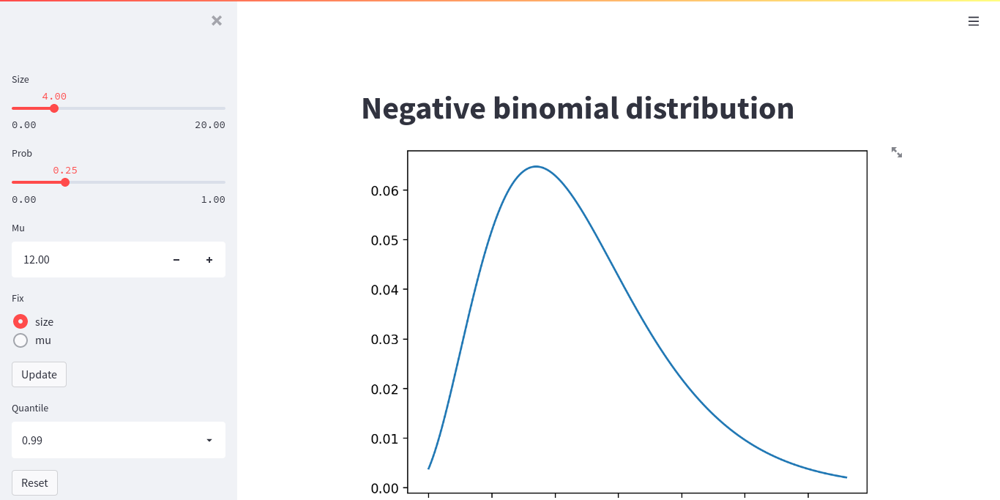

# nbinomPlotPy

The goal of nbinomPlotPy is to show an example of how to build, test, and deploy a Streamlit app.

[](https://github.com/zettsu-t/nbinomPlotPy/actions)



## Build and install

``` bash
python setup.py bdist_wheel
python -m pip install dist/nb_plot_streamlit-0.0.1-py3-none-any.whl
```

or in debugging

``` bash
python -m pip install -e .
```

## Example

This is a basic example that shows you how to launch the nbinomPlotPy app:

``` python
from nb_plot_streamlit.ui import draw

def main():
    draw()

if __name__ == '__main__':
    main()
```

## Run this app on Streamlit Server

Execute below on a shell

``` bash
streamlit run launcher/launch.py
```

and you can access the nbinomPlotPy app at <http://example.com:8501/>. Note that you have to replace the URL with an actual server.

The attached `Dockerfile`s and `docker-compose.yml` come in handy to make a Docker container to build, test, and run the Streamlit app. See [an introduction to use Python Package Template Project](https://github.com/zettsu-t/create-py-package) for more details.

``` bash
docker-compose build
docker build . -f launcher/Dockerfile -t streamlit_build
docker run -d -p 8501:8501 streamlit_build
```

## Check this app

### Run a headless display

Testing UIs with a headless browser requires a headless display. You can run Xvfb for this purpose. Note that Xvfb runs as root and testing as a user has to share the *DISPLAY* variable and `docker-compose.yml` can hold it.

Open a shell inside the Docker container as root

``` bash
docker ps
docker exec -it --user root container-ID /bin/bash
```

and run a headless display as root.

``` bash
export DISPLAY=:99
# Same as a default of a headless browser
Xvfb -ac -screen 0 1024x768x24 "${DISPLAY}" &
```

### Run tests

Open a shell inside the Docker container as a user.

``` bash
docker exec -it container-ID /bin/bash
```

and run the streamlit Server, launch this Streamlit app, and run tests.

``` bash
export DISPLAY=:99
python -m pip install -e .
yes "" | streamlit run launcher/launch.py &
# Wait until the Streamlit server is ready
# Run as a user, not as root
ps ux | grep firefox | awk '{print $2}' | xargs kill; pytest
```

To use Chrome instead of Firefox, set the environment variable USE_CHROME. Setting the environment variable GITHUB_ACTIONS disables tests of snapshots (this is a behavior in GitHub Actions).

``` bash
export USE_CHROME=1
export GITHUB_ACTIONS=1
```

### Check code

``` bash
flake8
pylint src/ tests/
mypy src/nb_plot_streamlit/*.py
pytest --cov=.
pytest --cov=. --cov-report=html
```

## Make documents of this package

First, run the Sphinx quickstart. When you asked if "Separate source and build directories (y/n) [n]:", reply "n" here.

``` bash
sphinx-quickstart
```

You can run sphinx-quickstart in non-interactive mode as below.

``` bash
sphinx-quickstart -q -p nbinomPlotPy -a "Author's name"
```

Second, edit `./conf.py` to apply the differences below.

``` python
-# import os
-# import sys
-# sys.path.insert(0, os.path.abspath('.'))
+import os
+import sys
+sys.path.insert(0, os.path.abspath('.'))

-extensions = [
+extensions = ['sphinx.ext.autodoc', 'sphinx.ext.coverage', 'sphinx.ext.napoleon'
```

Third, add Python modules to `./index.rst` as below.

```
.. automodule:: nb_plot_streamlit.ui
    :members:

.. automodule:: nb_plot_streamlit.nbinom
    :members:
```

Patches come in handy to apply these differences above.

``` bash
patch < patch/conf.py.diff
patch < patch/index.rst.diff
```

Final run `make html` and you can find documents of this packages in `_build/html/index.html`.

``` bash
make html
```

Note that Sphinx uses a single `:` as the field marker (not `@` in Javadoc) and a trailing `:` is required for a field and its options like `:type size: float` and `:rtype:`.
